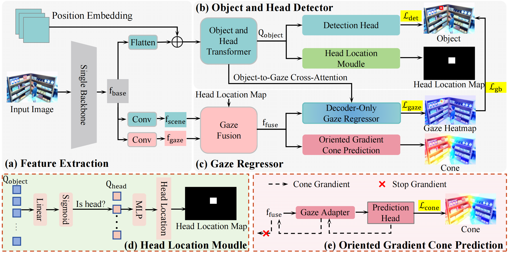

## TransGOP-R: Transformer-based Real-World Gaze
Object Prediction
This repository is the official implementation of TransGOP-R, an extension of TransGOP for studying real-world gaze object prediction tasks.
In this work, we propose a real-world gaze object prediction task and propose a Transformer-based gaze object prediction in a real-world setting (TransGOP-R) that does not rely on any head prior input and performs end-to-end evaluation.
Specifically, we design a head location module to generate a person's head position information from the head query. To optimize the gaze regressor, we introduced conic prediction
The model training phase allows the middle-layer features of the Gaze Regressor to construct the relationship between the target person and object before returning to the Gaze Point. In this process, an directional gradient mechanism is proposed to ensure that the target detection performance is not affected by the cone information. Experiments on GOO-Synth and GOOReal datasets demonstrate the superiority of the proposed method. At the same time, we gain an advantage over the human target gaze estimation methods on the GazeFollowing, VideoAttentionTarge, and ChildPlay datasets.


## Data Preparation
The GOO dataset contains two subsets: GOO-Sync and GOO-Real. 

You can download GOO-Synth dataset and annotations from Baidu Netdisk:

[GOOsynth-data and annotations](https://pan.baidu.com/s/1pe5kj9z3mFPl0guatPVrvA)(code:166j)


You can download GOO-Real dataset and annotations from Baidu Netdisk:

[GOOreal-data and annotations](https://pan.baidu.com/s/1Flfs15vBaCeuST5a5zkQiA)(code:pfni)


~~~~
Please ensure the data structure is as below

├── Datasets
   └── goosynth
       └── annotations
          ├── train.json
          ├── val.json
       └── val
          ├── 0.png
          ├── 1.png
          ├── ...
       └── train
          ├── 0.png
          ├── 1.png
          ├── ...
   └── gooreal
        └── annotations
          ├── train.json
          ├── val.json
        └── val
          ├── 0.png
          ├── 1.png
          ├── ...
        └── train
          ├── 0.png
          ├── 1.png
          ├── ...
~~~~

Environment Preparation


```
conda env create -n TransGOP-R -f environment.yaml
```

Compiling CUDA operators
   ```sh
   cd models/dino/ops
   python setup.py build install
   ```

## Training & Inference

To carry out experiments on the GOO dataset, please follow these commands:

Experiments on GOO-Synth:
```sh
bash scripts/TransGOP-R_train.sh /Dateses/goosynth/
```
Experiments on GOO-Real:
```sh
bash scripts/TransGOP-R_train.sh /Dateses/gooreal/
```


## Get_Result
Test on the GOO-Synth:

  ```sh
  bash scripts/TransGOP-R_eval.sh /Dateses/goosynth/ /path/to/your/checkpoint
  ```
Test on the GOO-Real:

  ```sh
  bash scripts/TransGOP-R_eval.sh /Dateses/gooreal/ /path/to/your/checkpoint
  ```
